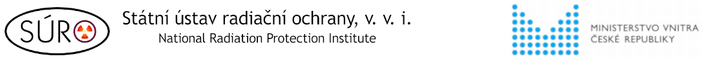
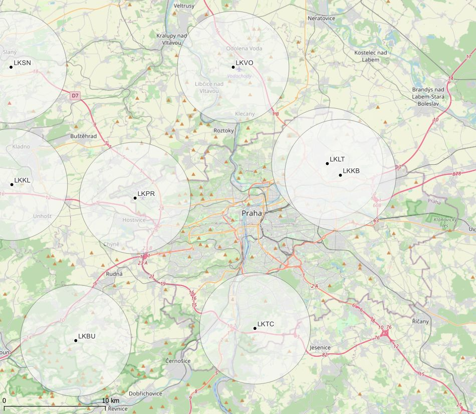

# Podpůrné GIS vrstvy pro letecký radiační monitoring

Tyto datové vrstvy vznikly v rámci řešení výzkumného projektu "[Posílení a rozvoj nástrojů, schopností a dovedností pro zajištění efektivního řízení odezvy na radiační havárii ve všech fázích včetně zohlednění požadavků Národního radiačního havarijního plánu ČR (VC20232025007)](https://starfos.tacr.cz/projekty/VC20232025007)" řešeného v Programu bezpečnostního výzkumu pro potřeby státu 2022-2027 (SecPro) jehož poskytovatelem je Ministerstvo vnitra České Republiky.

Vrstvy jsou k dispozici ve standardních formátech, ale primárně jsou určeny pro použití v bezpletém programu [QGIS](https://qgis.org/), doporučena je verze 1.40 a vyšší.

## Vrstva českých a slovenských letišť

*(background map © OpenStreetMap contributors)*

- bodová vrstva letišť vč. vloženého stylu zobrazení bodů i popisků
- polygonová vrstva kruhů o poloměru 5,5 km kolem bodů letišť - zóny ATZ (Aerodrome traffic zone), CTR (Control Zone) s ohledem na použití [UAV](https://ans.cz/services/UASoperaions/operationofdronesinthevicinityofaerodromes)
- doplňková data v atributové tabulce
- formát OGC Geopackage

Data pochází z databáze vnitrostátních i neveřejných letišť, které se nacházejí v České a Slovenské republice zveřejněné na webu [SkyFly](https://www.skyfly.cz/databaze-letist.php?kraje=&zeme=&povrch=&stranka=11)

----na obsahu se pracuje----

*Disclaimer:*
*Obsah tohoto repozitáře je poskytován "TAK JAK JE" a veškeré výslovné nebo předpokládané záruky, včetně, ale bez omezení na - předpokládané záruky obchodovatelnosti a vhodnosti pro specifické účely se odmítají. Autor nebo přispěvatelé nebudou v žádném případě odpovídat za jakékoliv přímé, nepřímé, náhodné, speciální, exemplární, nebo následné škody; ztrátu uplatnění, dat, nebo zisku) způsobené jakkoliv a na základě jakékoli teorie o
odpovědnosti, ať už smluvní odpovědnosti, přesně vymezené odpovědnosti, nebo občanskoprávní odpovědnosti (včetně zanedbání nebo jinak), vzniklé jakýmkoli způsobem, souvisejícím s používáním těchto datových vrstev.*
