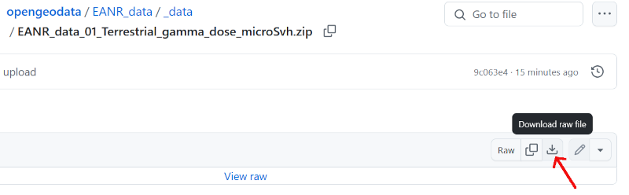

 

# European Atlas of Natural Radiation datasets for QGIS etc.

The aim of this website is to facilitate the use of [European Atlas of Natural Radiation](https://remon.jrc.ec.europa.eu/About/Atlas-of-Natural-Radiation) datasets published in the [Joint Research Centre (JRC) Data Catalogue](https://data.jrc.ec.europa.eu/collection/id-0057) in GIS applications - e.g. [QGIS](https://qgis.org/) or [SAGA GIS](https://sourceforge.net/projects/saga-gis/).

Data modification includes correcting/fixing the coordinate system/projection definition and conversion to another GIS formats:

- [GeoTIFF File Format](https://gdal.org/en/stable/drivers/raster/gtiff.html)

- [SAGA GIS Binary Grid File Format](https://gdal.org/en/stable/drivers/raster/sdat.html)

Each data package available here contains original and modified data, a description of the data with proper credits, a link to the original source, and a copyright notice.

**Use:**
Download package in ZIP file (click the link and then the Download raw file icon):

unpack to your computer and then just drag and drop the particular file to your app - *.tif or *.sdat file to QGIS, for SAGA GIS use *.sdat or *.sgrd file.

## Terrestrial gamma dose - version for Safecast / CzechRad users

**[Preview](_images/EANR_Terrestrial_gamma_dose_microSvh_preview.jpg)**

**Download:** [EANR_data_01_Terrestrial_gamma_dose_microSvh.zip (995 kB)](https://github.com/juhele/opengeodata/blob/master/EANR_data/_data/EANR_data_01_Terrestrial_gamma_dose_microSvh.zip)

**Description (JRC Data Catalogue):**
*The European Terrestrial Gamma Dose Rate map reports the gamma dose rate that a person may receive from terrestrial radiation.*

**License (JRC Data Catalogue):** [Creative Commons Attribution 4.0 International (CC BY 4.0)](https://creativecommons.org/licenses/by/4.0)

**Changes:**
In addition to the above-mentioned changes, this dataset is converted from nanoSv/h to microSv/h and the color style is unified with the style used in the [QGIS Radiation Toolbox plugin](https://opengeolabs.gitlab.io/radiation-toolbox/qgis-radiation-toolbox-plugin/) for Safecast/CzechRad data.

citation:
Tollefsen, Tore; De Cort, Marc; Cinelli, Giorgia; Gruber, Valeria; Bossew, Peter (2016): 07. Terrestrial gamma dose. European Commission, Joint Research Centre (JRC) [Dataset] PID: http://data.europa.eu/89h/jrc-eanr-07_terrestrial-gamma-dose
