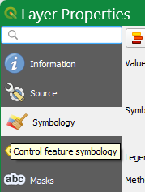
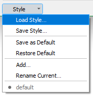

# ERS color styles

## Color style for AGC25 exercise

### Universal color ramp for QGIS - vectors and raster layers

This color ramp for QGIS was created based on information from the AGC25 Kick-Off Meeting:


and particular color codes derived from the image are following:
```
color; RGB color values
1;51,102,179
2;77,148,255
3;102,255,255
4;073,255,106
5;173,255,153
6;230,255,128
7;255,235,51
8;255,176,51
9;255,0,0
10;204,0,0
11;204,0,102
12;153,0,153
```
provided files:

**[AGC25_ARM25_color_ramp.xml](https://github.com/juhele/opengeodata/blob/master/ERS_-_European_Radiometric_and_Spectrometry_format/ERS_color_styling/AGC25_ARM25_color_ramp.xml)**
- preconfigured color ramp in QGIS XML format for easy import
- download package XML file (click the link and then the Download raw file icon):


- then follow [these instructions](https://docs.qgis.org/3.40/en/docs/user_manual/style_library/style_manager.html#importing-items) to import into QGIS  
- contains definition of the color classes / gradient, can be used for styling both vector and raster layers in QGIS - [for details see this page in QGIS manual](https://docs.qgis.org/3.40/en/docs/user_manual/working_with_vector/vector_properties.html#graduated-renderer)  

### Vector layers (point layers) styles - QGIS QML / SLD


- designed for particular variable, but can be switched to another using Layer properties / Symbology in QGIS
- prepared styles for DHSR (dose rate, microSv/h), MMGC_Ratio,
- QML is [QGIS Style File Format](https://docs.qgis.org/3.40/en/docs/user_manual/appendices/qgis_file_formats.html#qml-the-qgis-style-file-format) - QML file is defined for particular layer, contains information about used data column, value ranges and attached colors
- SLD is [Styled Layer Descriptor](https://www.ogc.org/standards/sld/) standard format
- **how to use the style in QGIS?** - go to Layer Properties / Symbology:

 

- then in bottom left corner go to Style / Load style and navigate to the particular QML or SLD file



## Color style used in PSI Bericht

the PSI Bericht Nr. 18-04 (1) defines this color scale:


and particular color codes derived from the image are following:
```
percentage; RGB color values; HTML code
≤0; 5:5:255; #0505FF
10; 51:85:255; #3355FF
20; 59:154:255; #3B9AFF
30; 36:229:255; #24E5FF
40; 112:255:210; #70FFD2
50; 182:255:145; #B6FF91
60; 228:255:76; #E4FF4C
70; 255:234:0; #FFEA00
80; 255:170:0; #FFAA00
90; 255:101:0; #FF6500
≥100; 255:0:0; #FF0000
```
provided files:

**ERS_color_ramps_QGIS.xml**
- preconfigured color ramps in QGIS XML format for easy import
- contains definition of the color classes / gradient, can be used for styling both vector and raster layers in QGIS

**QGIS_layer_color_style_example_ERS_DHSR_uSvph.qml**
- QGIS layer style file in native QML format
- QML file is defined for particular layer, contains information about used data column, value ranges and attached colors
- this example is derived from "Italy" demo data, but can be changed in QGIS and used for another layer and data column (requires changes and re-classification of the data in QGIS)

(1) Butterweck, G., Bucher, B., Gryc, L., Debayle, C., Strobl, C.,  Maillard, S., Thomas, M., Helbig, A., Krol, I., Chuzel, S., Couvez, C., Ohera, M., Rybach, L., Poretti, C.,  Hofstetter-Boillat, B., Mayer, S., Scharding, G.: International Intercomparison Exercise of Airborne Gamma-Spectrometric Systems of the Czech Republic, France, Germany and Switzerland in the Framework of the Swiss Exercise ARM17. PSI-Report No. 18-04, ISSN 1019-0643, Paul Scherrer Institut, Villigen, Switzerland, 2018.
https://www.researchgate.net/publication/330482739_International_Intercomparison_Exercise_of_Airborne_Gamma-Spectrometric_Systems_of_the_Czech_Republic_France_Germany_and_Switzerland_in_the_Framework_of_the_Swiss_Exercise_ARM17

(2) Alexander Bruy, Daria Svidzinska
Style Management in QGIS
https://hub.packtpub.com/style-management-qgis/
