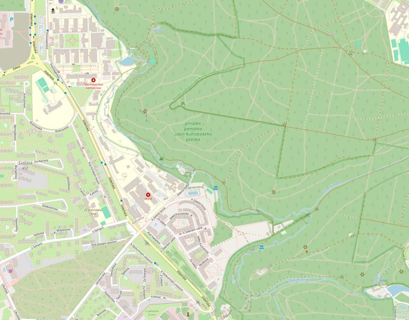
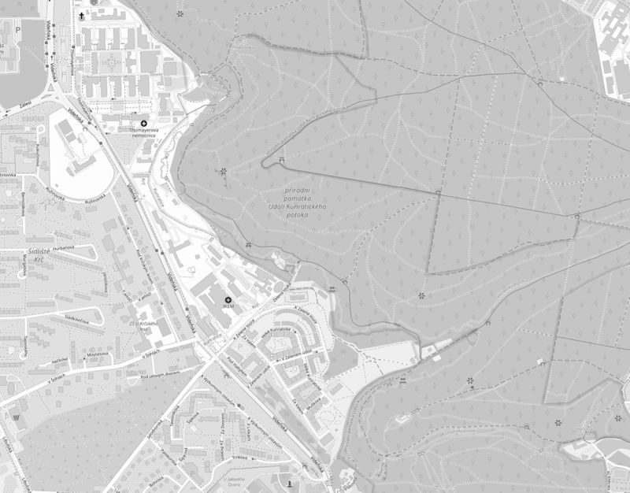
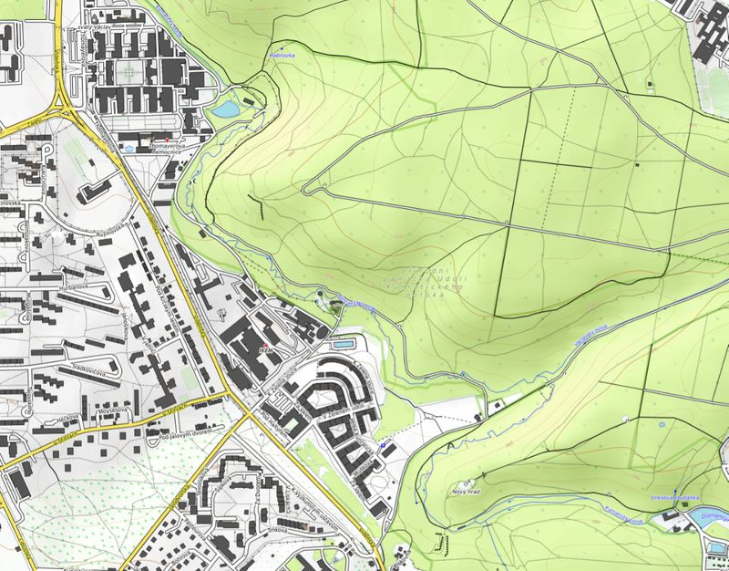
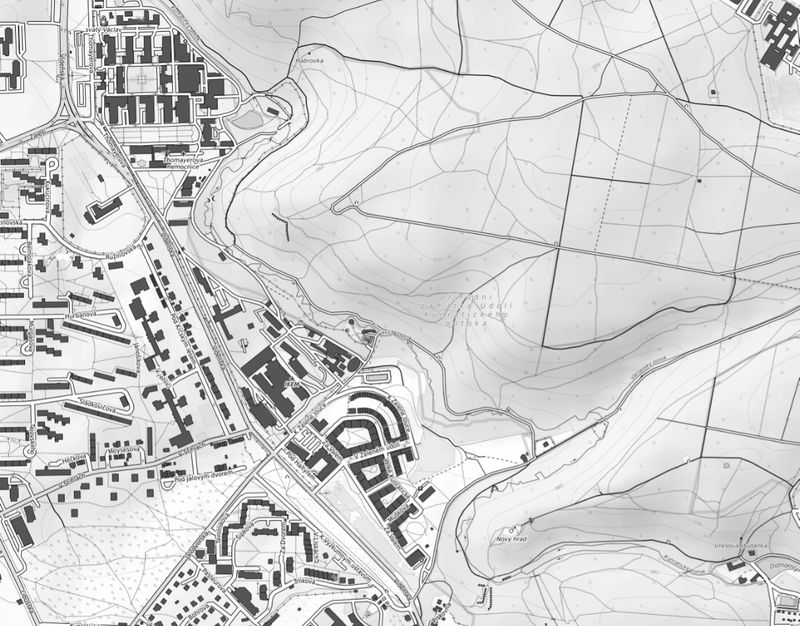

# Global scope layers

*Vrstvy globálního rozsahu*

## OpenStreetMap color
- default color style, EPSG:3857 Pseudo Mercator
- citation in maps: *Map background: © OpenStreetMap contributors (CC-BY-SA)*
- homepage: www.openstreetmap.org/

## OpenStreetMap grayscale
- color style changed to grayscale (you can easily do it by yourself in QGIS but for some users might be useful to have this file), EPSG:3857 Pseudo Mercator
- citation in maps: *Map background: © OpenStreetMap contributors (CC-BY-SA)*
- homepage: www.openstreetmap.org/

## OpenTopoMap color
- default color style, EPSG:3857 Pseudo Mercator
- citation in maps: *Map data: © OpenStreetMap contributors, SRTM | map style: © OpenTopoMap (CC-BY-SA) *
- homepage: https://www.opentopomap.org/

## OpenTopoMap grayscale
- color style changed to grayscale (you can easily do it by yourself in QGIS but for some users might be useful to have this file), EPSG:3857 Pseudo Mercator
- citation in maps: *Map background: © OpenStreetMap contributors (CC-BY-SA)*
- homepage: https://www.opentopomap.org/

