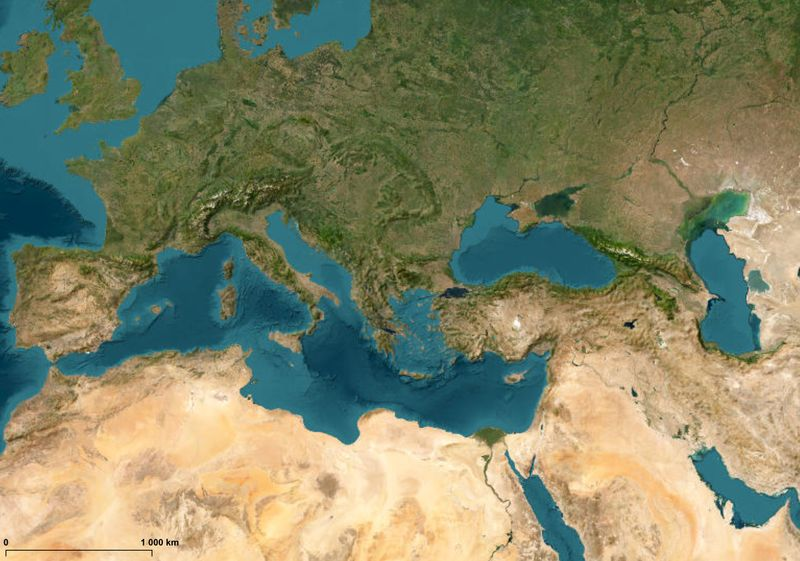
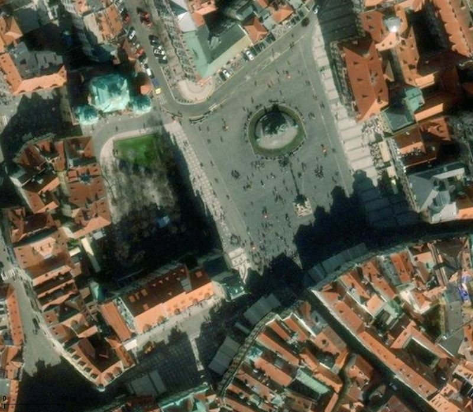

# Global scope layers

*Vrstvy globálního rozsahu*

## OpenStreetMap color
- default color style, EPSG:3857 Pseudo Mercator
- citation in maps: *Map background: © OpenStreetMap contributors (CC-BY-SA)*
- homepage: www.openstreetmap.org/

## OpenStreetMap grayscale
- color style changed to grayscale (you can easily do it by yourself in QGIS but for some users might be useful to have this file), EPSG:3857 Pseudo Mercator
- citation in maps: *Map background: © OpenStreetMap contributors (CC-BY-SA)*
- homepage: www.openstreetmap.org/

## OpenTopoMap color
- default color style, EPSG:3857 Pseudo Mercator
- citation in maps: *Map data: © OpenStreetMap contributors, SRTM | map style: © OpenTopoMap (CC-BY-SA)*
- homepage: https://www.opentopomap.org/

## OpenTopoMap grayscale
- color style changed to grayscale (you can easily do it by yourself in QGIS but for some users might be useful to have this file), EPSG:3857 Pseudo Mercator
- citation in maps: *Map data: © OpenStreetMap contributors, SRTM | map style: © OpenTopoMap (CC-BY-SA)*
- homepage: https://www.opentopomap.org/

## ESRI World Imagery
- default color style, EPSG:3857 Pseudo Mercator
- description: *"World Imagery provides one meter or better satellite and aerial imagery in many parts of the world and lower resolution satellite imagery worldwide. The map includes 15-meter TerraColor imagery at small and mid-scales (~1:591M down to ~1:288k) for the world. The map features Maxar imagery at 0.3-meter resolution for select metropolitan areas around the world, 0.5-meter resolution across the United States and parts of Western Europe, and 0.6-1.2-meter resolution imagery across the rest of the world. In addition to commercial sources, the World Imagery map features high-resolution aerial photography contributed by the GIS User Community. This imagery ranges from 0.3-meter to 0.03-meter resolution, down to ~1:280 in select communities."*
- citation in maps - see provider website
- homepage: h[ttps://www.opentopomap.org/](https://www.arcgis.com/home/item.html?id=10df2279f9684e4a9f6a7f08febac2a9)

