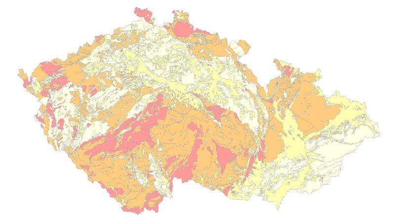
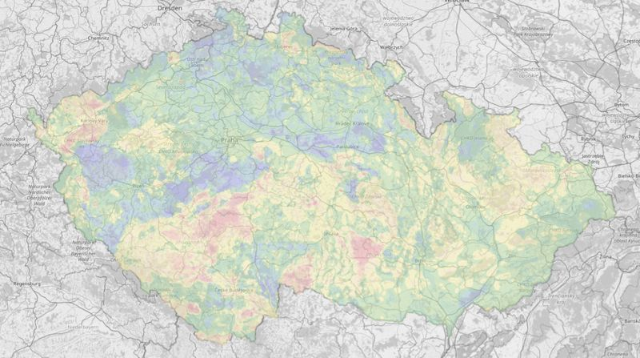

# Country-specific layers

*Vrstvy pro specifické země*

## Czech Republic / Česká republika (CZE)

## CENIA Historická ortofotomapa (50. léta)
- default color style, EPSG:3857 Pseudo Mercator
- "Historická ortofotomapa zahrnuje vrstvy leteckých snímků převážně z let 1952-1954, doplněných o snímky z let 1937-1970 a 1996 tam, kde v daném období neexistují příslušné snímkové podklady. Ortofotomapa České republiky z historických snímků prvního plošného celostátního leteckého snímkování z 50. let vznikla v rámci projektu Národní inventarizace kontaminovaných míst (NIKM). Letecké měřické snímky poskytnuté Vojenským geografickým a hydrometeorologickým úřadem (VGHMÚř) Dobruška zpracovala společnost GEODIS BRNO, spol. s r.o."
- citation in maps: *Historická ortofotomapa © CENIA 2010 a © GEODIS Brno, spol. s r.o. 2010 Podkladové letecké snímky poskytl VGHMÚř Dobruška, © MO ČR 2009.*
- license: https://creativecommons.org/licenses/by/4.0/
- homepage: https://micka.cenia.cz/record/basic/50210752-9d9c-4f47-956b-1951c0a80137

## ČÚZK Ortofoto ČR (aktuální ortofoto)
- default color style, EPSG:4326 WGS 84
- citation in maps: *background map WMS - Ortofoto © Czech Office for Surveying, Mapping and Cadastre (ČÚZK)*
- citace v mapě česky: *mapový podklad WMS - Ortofoto © Český úřad zeměměřický a katastrální (ČÚZK)*
- homepage: https://geoportal.cuzk.cz/(S(vpqvbn3bqwdkawmjinb03elg))/Default.aspx?menu=3121&mode=TextMeta&side=wms.verejne&metadataID=CZ-CUZK-WMS-ORTOFOTO-P&metadataXSL=metadata.sluzba

## ČÚZK Ortofoto ČR (aktuální ortofoto) - grayscale version / černobílá varianta
- color style changed to grayscale (you can easily do it by yourself in QGIS but for some users might be useful to have this file), EPSG:4326 WGS 84
- citation in maps: *background map WMS - Ortofoto © Czech Office for Surveying, Mapping and Cadastre (ČÚZK)*
- citace v mapě česky: *mapový podklad WMS - Ortofoto © Český úřad zeměměřický a katastrální (ČÚZK)*
- homepage: https://geoportal.cuzk.cz/(S(vpqvbn3bqwdkawmjinb03elg))/Default.aspx?menu=3121&mode=TextMeta&side=wms.verejne&metadataID=CZ-CUZK-WMS-ORTOFOTO-P&metadataXSL=metadata.sluzba

## Mapa radonového indexu 1 : 500 000 (GEOČR500) / Radon risk map 1 : 500,000 (GEOCR500) (raster version)
- transparency set to 50% so you can use it as map overlay, EPSG:4326 WGS 84
- citation in maps: *Radon risk map 1 : 500,000 (GEOCR500) © Czech Geological Survey*
- citace v mapě česky: *Mapa radonového indexu 1 : 500 000 (GEOČR500) © Česká geologická služba*
- homepage: https://micka.geology.cz/record/basic/515179ac-dfdc-4fcf-871b-1e400a010817

## Radiometrická mapa 1 : 500 000 (GEOČR500) / Radiometric field map 1 : 500,000 (GEOCR500)
- transparency set to 50% so you can use it as map overlay, EPSG:5514
- preview image uses OpenStreetMap background, grayscale version
- citation in maps: *RRadiometric field map 1 : 500,000 (GEOCR500) © Czech Geological Survey*
- citace v mapě česky: *Radiometrická mapa 1 : 500 000 (GEOČR500) © Česká geologická služba*
- homepage: [https://micka.geology.cz/record/basic/515179ac-dfdc-4fcf-871b-1e400a010817](https://micka.geology.cz/record/basic/5addde3d-9424-4e84-bb16-38b40a010852)

----
