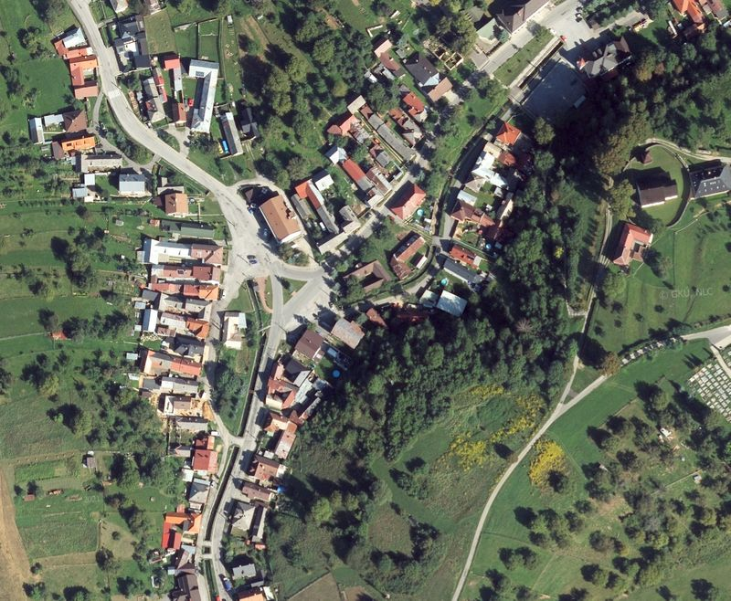

# Country-specific layers

*Vrstvy pro specifické země*

## Slovak Republic / Slovenská republika (SVK)

## ZBGIS Ortofotomozaika
- default color style, EPSG:3857 Pseudo Mercator
- poskytovatel: Geodetický a kartografický ústav Bratislava
- license: CC BY 4.0 https://creativecommons.org/licenses/by/4.0/
- homepage: https://www.geoportal.sk/sk/sluzby/mapove-sluzby/wms/wms-zbgis.html

