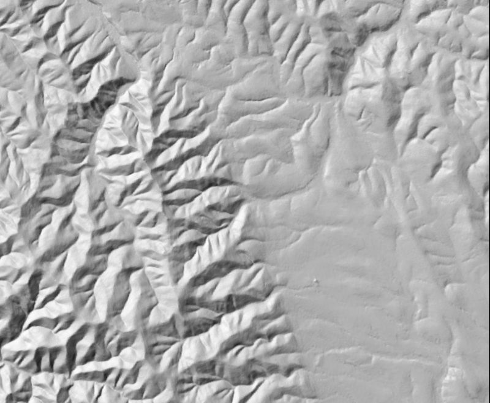
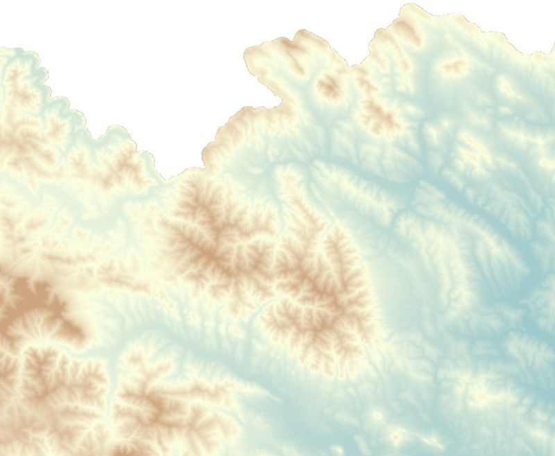
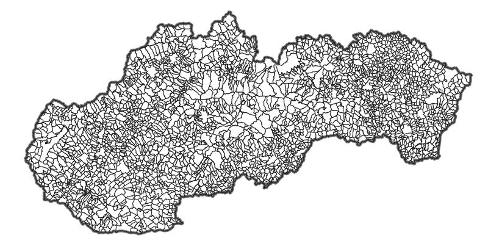
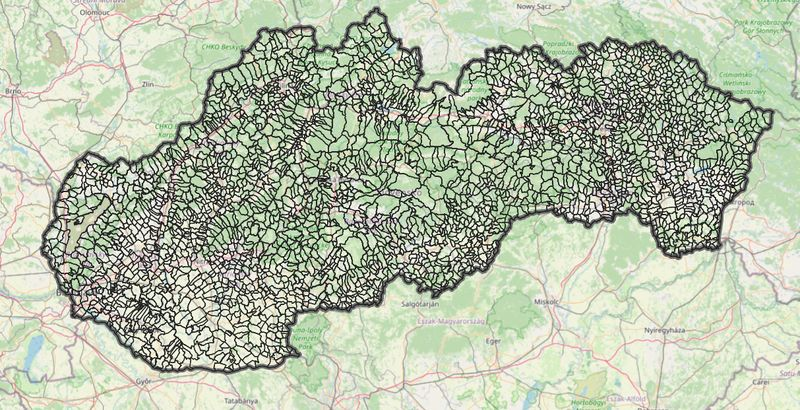

# Country-specific layers

*Vrstvy pro specifické země*

## Slovak Republic / Slovenská republika (SVK)

## ZBGIS Ortofotomozaika
- default color style, EPSG:3857 Pseudo Mercator
- poskytovatel: Geodetický a kartografický ústav Bratislava
- license: CC BY 4.0 https://creativecommons.org/licenses/by/4.0/
- homepage: https://www.geoportal.sk/sk/sluzby/mapove-sluzby/wms/wms-zbgis.html

## ZBGIS®/DMR3/Tieňovaný reliéf
- default color style, EPSG:3857 Pseudo Mercator
- poskytovatel: Geodetický a kartografický ústav Bratislava
- license: CC BY 4.0 https://creativecommons.org/licenses/by/4.0/
- homepage: https://www.geoportal.sk/sk/sluzby/mapove-sluzby/wms/wms-zbgis.html

## ZBGIS Digitálny model reliéfu (DMR3.5)
- default color style, EPSG:3857 Pseudo Mercator
- poskytovatel: Geodetický a kartografický ústav Bratislava
- license: CC BY 4.0 https://creativecommons.org/licenses/by/4.0/
- homepage: https://www.geoportal.sk/sk/sluzby/mapove-sluzby/wms/wms-zbgis.html

## ZBGIS Administratívne hranice (vector data)
- default color style, EPSG:3857 Pseudo Mercator
- 4 vrstvy: státní hranice SR, kraje, okresy, obce
- upraven styl kvůli průhlednosti a sjednocení s českým RÚIAN
- poskytovatel: Geodetický a kartografický ústav Bratislava
- license: CC BY 4.0 https://creativecommons.org/licenses/by/4.0/
- homepage: https://www.geoportal.sk/sk/sluzby/mapove-sluzby/wfs/
- náhled bez mapového podkladu:

- náhled s podkladem OpenStreetMap

