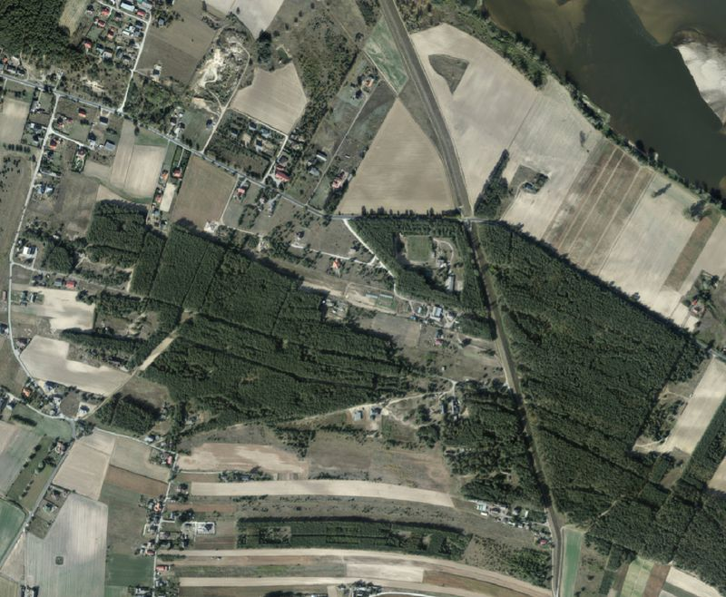
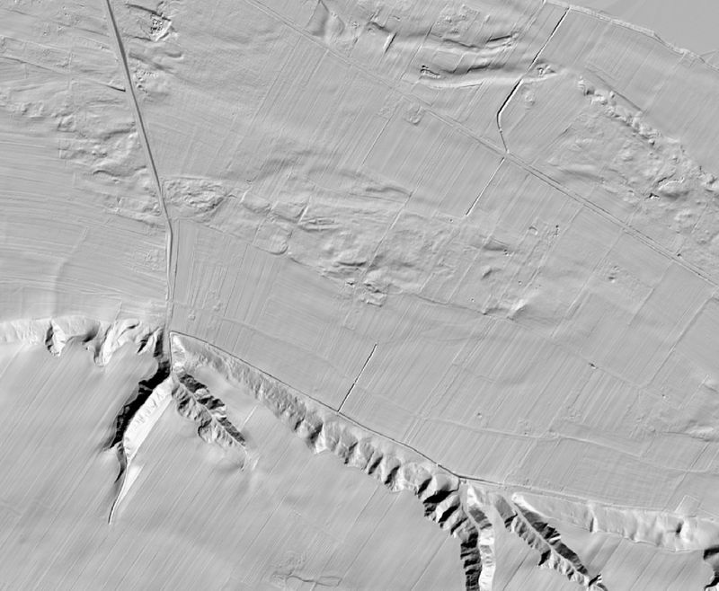

# Country-specific layers

*Vrstvy pro specifické země*

## Republic of Poland / Rzeczpospolita Polska (POL)

**You can get plenty of data using links from the [poland-gis-datasets GitHub page](https://github.com/sk1me/poland-gis-datasets) and services from [geoportal.gov.pl](https://www.geoportal.gov.pl/en/services/view-services-wms-and-wmts/)**

## Orthophotomap - high resolution
- default colors, EPSG:4326 WGS 84
- provider: Państwowy zasób geodezyjny i kartograficzny (PZGiK)
- homepage: https://www.geoportal.gov.pl/pl/dane/ortofotomapa-orto/

## Digital Terrain Model - Hillshade
- default colors, EPSG:4326 WGS 84
- provider: Główny Urząd Geodezji i Kartografii
- homepage: https://www.geoportal.gov.pl/en/services/view-services-wms-and-wmts/

## Mapa Geologiczna Polski w skali 1:500 000
- transparency set to 50% so you can use it as map overlay, EPSG:4326 WGS 84
- preview image uses OpenStreetMap background, grayscale version
- "Mapa Geologiczna Polski w skali 1:500 000 – sondowania geoelektryczne SGE w usłudze WMS Centralnej Bazy Danych Geologicznych (CBDG)."
- homepage: https://dane.gov.pl/pl/dataset/772,mapa-geologiczna-polski-w-skali-1500-000/resource/39503/table

