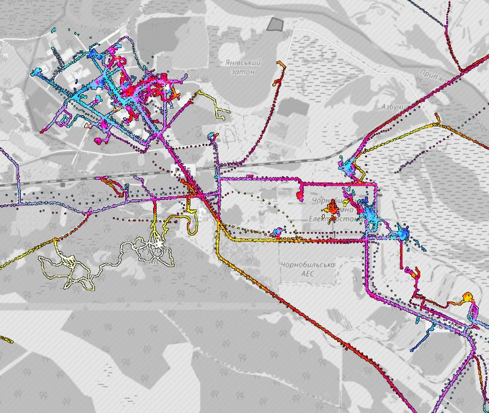
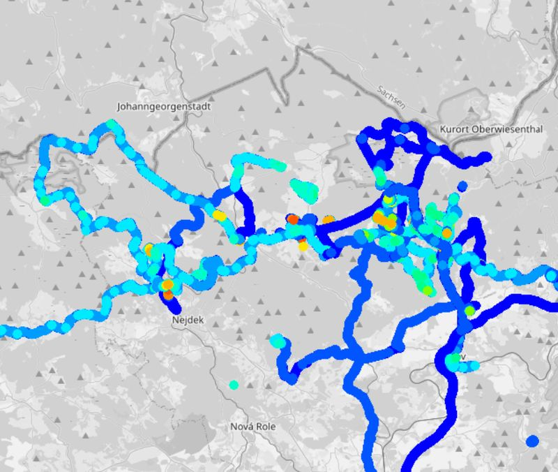
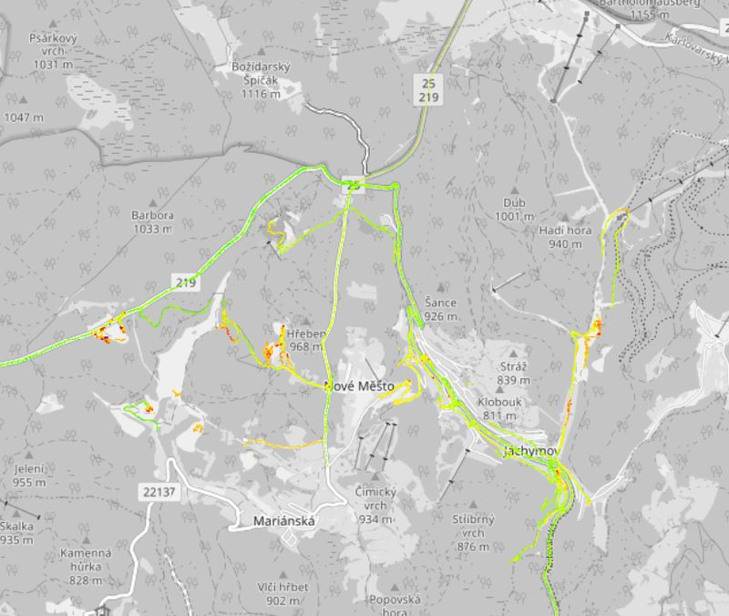
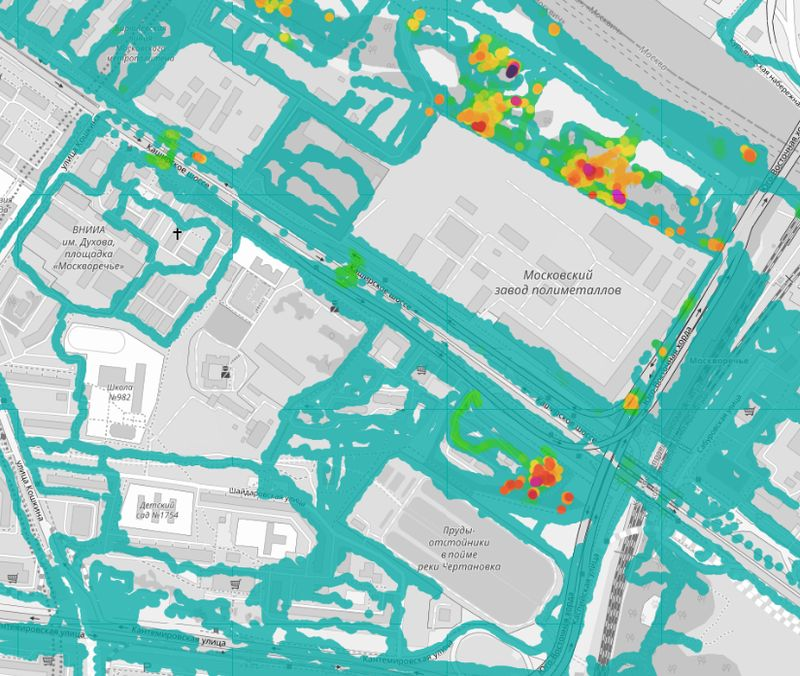

# Layers of citizen measurements of radiation values ​​(radioactivity) - global scope

*Vrstvy občanských měření hodnot radiace (radioaktivity) - globální rozsah*

## Safecast Tile Map
- default color style, EPSG:3857 Pseudo Mercator
- raster layer - you cannot change colors or query values from QGIS
- dose rate, microSv/h
- legend image is loading from this GitHub
- homepage: https://map.safecast.org/

## Žhavá Místa (English: Hot Places) Map
- default color style, EPSG:3857 Pseudo Mercator
- raster layer - you cannot change colors or query values from QGIS
- dose rate, microSv/h
- legend image is loading from this GitHub
- homepage: https://www.zhavamista.cz/mapa

## Raysid.com Map
- default color style, EPSG:3857 Pseudo Mercator
- raster layer - you cannot change colors or query values from QGIS
- legend image is loading from this GitHub
- homepage: https://raysid.com/map/

## Dosemap.org Map
- default color style, EPSG:3857 Pseudo Mercator
- raster layer - you cannot change colors or query values from QGIS
- dose rate, microSv/h
- legend image is loading from this GitHub
- homepage: https://dosemap.org/

