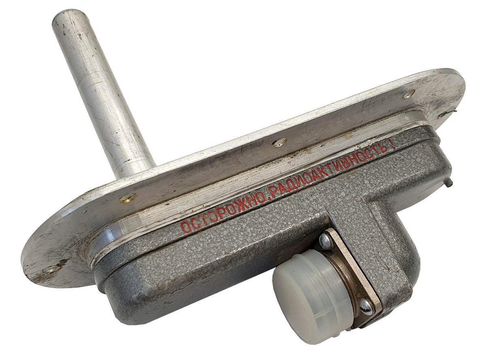

# Data measured by SÚRO employees 

The data files are licensed under [Attribution-ShareAlike 4.0 International (CC BY-SA 4.0) license](https://creativecommons.org/licenses/by-sa/4.0/)

# Table of contents

  - [01_spectra_natural_background](#01_spectra_natural_background)
  - [02_spectra_radon_bottle](#02_spectra_radon_bottle)
  - [03_spectra_potassium_fertilizer](#03_spectra_potassium_fertilizer)
  - [04_spectra_uranium_glass](#04_spectra_uranium_glass)
  - [05_spectra_uraninite-pitchblende](#05_spectra_uraninite-pitchblende)
  - [05_spectra_uraninite-pitchblende](#05_spectra_uraninite-pitchblende)
  - [06_spectra_Jachymov_Retizkarna](#06_spectra_jachymov_retizkarna)
  - [07_spectra_tritium_keychain](#07_spectra_tritium_keychain)
  - [08_spectra_EG_3X_source_Cs-137](#08_spectra_eg_3x_source_cs-137)
  - [09_spectra_EG_3X_source_Co-60](#09_spectra_eg_3x_source_co-60)
  - [10_spectra_EG_3X_sources_Co-60_and_Cs-137](#10_spectra_EG_3X_sources_Co-60_and_Cs-137)
  - [11_spectra_EG_3X_source_Am-241](#11_spectra_EG_3X_source_Am-241)
  - [12_spectra_RIO-3_ice_detector_Sr-90_and_Y-90](#12_spectra_RIO-3_ice_detector_Sr-90_and_Y-90)
  - [13_spectra_granodiorite_rock](#13_spectra_granodiorite_rock)
  - [14_spectra_thorium-rich_material](#14_spectra_thorium-rich_material)
  - [15_spectra_EG_3_source_Ba-133](#15_spectra_EG_3_source_Ba-133)
  - [16_spectra_EG_3X_source_Co-57](#16_spectra_EG_3X_source_Co-57)
  - [17_spectra_EG_3_source_Eu-152](#17_spectra_EG_3_source_Eu-152)

## 01_spectra_natural_background

- common natural background, spectra "office" - measured in SÚRO office, 2nd floor; spectra "outside" - detector (in plastic bag) laid on the lawn in the garden
- data acquisition time: "office": ~ 20 min, ~ 1 hour; "outside": ~40 min, ~50 min
- download: [01_spectra_natural_background.zip](https://github.com/juhele/opengeodata/blob/master/amateur_spectrometry/_SURO_data/Spectra_XML/01_spectra_natural_background.zip)

## 02_spectra_radon_bottle

- background spectrum "Background - office 1 hour" - measured in SÚRO office, 2nd floor
- radon in common plastic bottle
- radon itself is a source of alpha radiation, but in the spectrum we detect its decay products ("radon daughters") - radioactive isotopes of Bi, Po, Pb
- data acquisition times: background: ~ 1 hour; radon bottle: ~10 min, ~20 min, ~1 hour
- download: [02_spectra_radon_bottle.zip](https://github.com/juhele/opengeodata/blob/master/amateur_spectrometry/_SURO_data/Spectra_XML/02_spectra_radon_bottle.zip)

## 03_spectra_potassium_fertilizer

- background spectrum "Background - office 1 hour" - measured in SÚRO office, 2nd floor
- commercial potassium fertilizer from garden centre
- approximately 0.01% of potassium is radioactive potassium isotope K-40
- depending on the type, the activity of K-40 in the fertilizer is approximately in the range of 2.5 - 7.7 kBq / kg
- check K-40 peak at 1460.8 keV
- data acquisition time: background: ~ 1 hour; potassium fertilizer: ~12 min
- download: [03_spectra_potassium_fertilizer.zip](https://github.com/juhele/opengeodata/blob/master/amateur_spectrometry/_SURO_data/Spectra_XML/03_spectra_potassium_fertilizer.zip)

## 04_spectra_uranium_glass

- background spectrum "Background - office 1 hour" - measured in SÚRO office, 2nd floor
- an object made of currently produced uranium glass (also nicknamed "Vaseline glass")
- according to the information from the State Office for Nuclear Safety (SÚJB) currently produced uranium glass in the Czech Republic should not contain more than 1% uranium (article in Czech): [Problematika uranem barveného skla](https://www.sujb.cz/radiacni-ochrana/oznameni-a-informace/problematika-uranem-barveneho-skla)
- data acquisition time: background: ~ 1 hour; uranium glass: ~10 min
- download: [04_spectra_uranium_glass.zip](https://github.com/juhele/opengeodata/blob/master/amateur_spectrometry/_SURO_data/Spectra_XML/04_spectra_uranium_glass.zip)

## 05_spectra_uraninite-pitchblende

- background spectrum "Background - office 1 hour" - measured in SÚRO office, 2nd floor
- sample of uraninite UO₂ (also known as smolinec, Pechblende, pitchblende)
- uranium mineral, most important uranium ore, this sample is from Příbrami or Jáchymov
- data acquisition time: background: ~ 1 hour; uraninite: ~10 min
- download: [05_spectra_uraninite-pitchblende.zip](https://github.com/juhele/opengeodata/blob/master/amateur_spectrometry/_SURO_data/Spectra_XML/05_spectra_uraninite-pitchblende.zip)

## 05_spectra_uraninite-pitchblende

- background spectrum "Background - office 1 hour" - measured in SÚRO office, 2nd floor
- sample of uraninite UO2 (also known as smolinec, Pechblende, pitchblende)
- uranium mineral, most important uranium ore, this sample is from Příbrami or Jáchymov
- data acquisition time: background: ~ 1 hour; uraninite: ~10 min
- download: [05_spectra_uraninite-pitchblende.zip](https://github.com/juhele/opengeodata/blob/master/amateur_spectrometry/_SURO_data/Spectra_XML/05_spectra_uraninite-pitchblende.zip)

## 06_spectra_Jachymov_Retizkarna

- background spectrum "Background - office 1 hour" - measured in SÚRO office, 2nd floor
- the other spectra were measured in [Jáchymov](https://en.mapy.cz/s/recavuramo), in the area of former uranium mine and labor camp Rovnost (English "Equality"), some [photos here](https://flic.kr/s/aHBqjzPg5g) 
- the name comes from Czech "Řetízkárna" - nickname for the building of the former chain locker room
- some spectra are from the building, one from the road in front of it, another from the Hotel Berghof garden
- data acquisition time: background: ~ 1 hour; field measurements: ~3-12 min
- download: [06_spectra_Jachymov_Retizkarna.zip](https://github.com/juhele/opengeodata/blob/master/amateur_spectrometry/_SURO_data/Spectra_XML/06_spectra_Jachymov_Retizkarna.zip)

## 07_spectra_tritium_keychain

- background spectrum "Background - office 1 hour" - measured in SÚRO office, 2nd floor
- commercially avalable tritium keychain "nite GlowRing" - ([photo here](https://flic.kr/p/2kkHGoj)) - transparent plastic case contains sealed borosilicate glass vial with internal surface coated with a phosphor-containing material and filled with tritium gas, the beta particles from the tritium decay interact with the coating and produce visible glow 
- it is called GTLS ("gaseous tritium light source")
- the beta radiation is not able to pass through the glass wall, but GTLS devices do emit low levels of X-rays due to bremsstrahlung:
["Gaseous tritium light sources (GTLSs) and gaseous tritium light devices (GTLDs)" (PDF). Radiation Safety Handbook. Ministry of Defence (United Kingdom). May 2009. JSP 392](https://assets.publishing.service.gov.uk/government/uploads/system/uploads/attachment_data/file/946070/JSP_392_Chapter_19_-_GTLS_-GTLD__Alt_Text_.pdf)
- data acquisition time: background: ~ 1 hour; tritium: ~1 hour, ~4 hours
- download: [07_spectra_tritium_keychain.zip](https://github.com/juhele/opengeodata/blob/master/amateur_spectrometry/_SURO_data/Spectra_XML/07_spectra_tritium_keychain.zip)

## 08_spectra_EG_3X_source_Cs-137

- background spectrum "Background - office 1 hour" - measured in SÚRO office, 2nd floor
- Cs-137 radionuclide source (instrument check source) from Czech metrology institute (Czech: Český metrologický institut, ČMI, [product catalogue](https://www.cmi.cz/sites/all/files/public/download/katalog_OI%20Praha_2015_%C4%8Desky.pdf) (Czech only)), in 10 cm distance from the detector
- Cs-137, type: EG 3X, activity: 858.9 kBq, reference date: 1.7. 2015
- data acquisition time: background: ~ 1 hour; Cs-137: ~10 min, ~1 hour
- download: [08_spectra_EG_3X_source_Cs-137.zip](https://github.com/juhele/opengeodata/blob/master/amateur_spectrometry/_SURO_data/Spectra_XML/08_spectra_EG_3X_source_Cs-137.zip)

*Illustrative image and diagram of EG X type radionuclide source (image source: ČMI, translated)*

# 09_spectra_EG_3X_source_Co-60

- background spectrum "Background - office 1 hour" - measured in SÚRO office, 2nd floor
- Co-60 radionuclide source (instrument check source) from Czech metrology institute (Czech: Český metrologický institut, ČMI, [product catalogue](https://www.cmi.cz/sites/all/files/public/download/katalog_OI%20Praha_2015_%C4%8Desky.pdf) (Czech only)), in 10 cm distance from the detector
- Co-60, type: EG 3X, activity: 807.7 kBq, reference date: 1.7. 2015
- data acquisition time: background: ~ 1 hour; Co-60: ~10 min, ~1 hour
- download: [09_spectra_EG_3X_source_Co-60.zip](https://github.com/juhele/opengeodata/blob/master/amateur_spectrometry/_SURO_data/Spectra_XML/09_spectra_EG_3X_source_Co-60.zip)

# 10_spectra_EG_3X_sources_Co-60_and_Cs-137

- background spectrum "Background - office 1 hour" - measured in SÚRO office, 2nd floor
- Co-60 and Cs-137 radionuclide sources (instrument check source) from Czech metrology institute (Czech: Český metrologický institut, ČMI, [product catalogue](https://www.cmi.cz/sites/all/files/public/download/katalog_OI%20Praha_2015_%C4%8Desky.pdf) (Czech only)), in 10 cm distance from the detector
- Co-60, type: EG 3X, activity: 807.7 kBq, reference date: 1.7. 2015
- Cs-137, type: EG 3X, activity: 858.9 kBq, reference date: 1.7. 2015
- data acquisition time: background: ~ 1 hour; Co-60 and Cs-137: ~10 min, ~1 hour
- download: [10_spectra_EG_3X_sources_Co-60_and_Cs-137.zip](https://github.com/juhele/opengeodata/blob/master/amateur_spectrometry/_SURO_data/Spectra_XML/10_spectra_EG_3X_sources_Co-60_and_Cs-137.zip)

# 11_spectra_EG_3X_source_Am-241

- background spectrum "Background - office 1 hour" - measured in SÚRO office, 2nd floor
- Am-241 radionuclide source (instrument check source) from Czech metrology institute (Czech: Český metrologický institut, ČMI, [product catalogue](https://www.cmi.cz/sites/all/files/public/download/katalog_OI%20Praha_2015_%C4%8Desky.pdf) (Czech only)), in 10 cm distance from the detector
- Am-241, type: EG 3X, activity: 864.5 kBq, reference date: 1.7. 2015
- data acquisition time: background: ~ 1 hour; Am-241: ~10 min, ~15 min, ~30 min, ~1 hour
- download: [11_spectra_EG_3X_source_Am-241.zip](https://github.com/juhele/opengeodata/blob/master/amateur_spectrometry/_SURO_data/Spectra_XML/11_spectra_EG_3X_source_Am-241.zip)

# 12_spectra_RIO-3_ice_detector_Sr-90_and_Y-90

- background spectrum "Background - office 1 hour" - measured in SÚRO office, 2nd floor
- RIO-3 (РИО-3) type ice detector with radioactive material (Strontium 90) used in aviation (for example for Mi-8/Mi-17 helicopters), measured in 10 cm distance from the detector
- information in Russian (Wikipedia) - [Сигнализатор обледенения](https://ru.wikipedia.org/wiki/%D0%A1%D0%B8%D0%B3%D0%BD%D0%B0%D0%BB%D0%B8%D0%B7%D0%B0%D1%82%D0%BE%D1%80_%D0%BE%D0%B1%D0%BB%D0%B5%D0%B4%D0%B5%D0%BD%D0%B5%D0%BD%D0%B8%D1%8F), full resolution photos - [Flickr - RIO-3](https://www.flickr.com/search/?user_id=96541566%40N06&sort=date-taken-desc&text=Rio-3&view_all=1)
- data acquisition time: background: ~ 1 hour; RIO-3: ~10 min, ~20 min
- download: [12_spectra_RIO-3_ice_detector_Sr-90_and_Y-90.zip](https://github.com/juhele/opengeodata/blob/master/amateur_spectrometry/_SURO_data/Spectra_XML/12_spectra_RIO-3_ice_detector_Sr-90_and_Y-90.zip)

*RIO-3 (РИО-3) type ice detector - Photo: Jan Helebrant, license CC-BY-SA*

# 13_spectra_granodiorite_rock

- background spectrum "Background - office 1 hour" - measured in SÚRO office, 2nd floor
- granodiorite rock - coarse-grained intrusive igneous rock similar to granite, known for containing higher amounts of natural radionuclides (K, U, Th) and thus having radioactivity above common natural background
- RadiaCode in a plastic bag placed directly on the stone, measured in the [Sporilov Geopark](https://www.ig.cas.cz/en/outreach/geopark-prague/)
- data acquisition time: background: ~ 1 hour; granodiorite: ~10 min
- download: [13_spectra_granodiorite_rock.zip](https://github.com/juhele/opengeodata/blob/master/amateur_spectrometry/_SURO_data/Spectra_XML/13_spectra_granodiorite_rock.zip)

# 14_spectra_thorium-rich_material

- background spectrum "Background - office 1 hour" - measured in SÚRO office, 2nd floor
- thorium rich material - by-product of [titanium dioxide](https://en.wikipedia.org/wiki/Titanium_dioxide) (also known as "titanium white") production using [ilmenite](https://en.wikipedia.org/wiki/Ilmenite) mineral (FeTiO3) and [sulfate process]([link](https://en.wikipedia.org/wiki/Titanium_dioxide))
- this material could be defined as Naturally occurring radioactive material [(NORM)](https://en.wikipedia.org/wiki/Naturally_occurring_radioactive_material) or technologically enhanced naturally occurring radioactive material (TENORM)
- ilmenite is known to also contain natural radionuclides like Uranium-238 and Thorium-232
- sample in 10 cm distance from the detector
- data acquisition time: background: ~ 1 hour; thorium material: ~10 min, ~1 hour, ~2 hours
- download: [14_spectra_thorium-rich_material.zip](https://github.com/juhele/opengeodata/blob/master/amateur_spectrometry/_SURO_data/Spectra_XML/14_spectra_thorium-rich_material.zip)

References:

[Measurement of 238U and 232Th radionuclides in ilmenite and synthetic rutile
M I Idris et al 2018 IOP Conf. Ser.: Mater. Sci. Eng. 298 012010](https://iopscience.iop.org/article/10.1088/1757-899X/298/1/012010/pdf)

[Haridasan PP, Pillai PM, Tripathi RM, Puranik VD. Thorium in ilmenite and its radiological implications in the production of titanium dioxide. Radiat Prot Dosimetry. 2008;129(4):381-5. doi: 10.1093/rpd/ncm446. Epub 2007 Oct 19. PMID: 17951239.](https://pubmed.ncbi.nlm.nih.gov/17951239/)

# 15_spectra_EG_3_source_Ba-133

- background spectrum "Background - office 1 hour" - measured in SÚRO office, 2nd floor
- Ba-133 radionuclide source (instrument check source) from Czech metrology institute (Czech: Český metrologický institut, ČMI, [product catalogue](https://www.cmi.cz/sites/all/files/public/download/katalog_OI%20Praha_2015_%C4%8Desky.pdf) (Czech only)), in 10 cm distance from the detector
- Ba-133, type: EG 3, activity: 82.36 kBq, reference date: 30.12. 2017
- data acquisition time: background: ~ 1 hour; Ba-133: ~10 min, ~1 hour
- download: [15_spectra_EG_3_source_Ba-133.zip](https://github.com/juhele/opengeodata/blob/master/amateur_spectrometry/_SURO_data/Spectra_XML/15_spectra_EG_3_source_Ba-133.zip)

# 16_spectra_EG_3X_source_Co-57

- background spectrum "Background - office 1 hour" - measured in SÚRO office, 2nd floor
- Co-57 radionuclide source (instrument check source) from Czech metrology institute (Czech: Český metrologický institut, ČMI, [product catalogue](https://www.cmi.cz/sites/all/files/public/download/katalog_OI%20Praha_2015_%C4%8Desky.pdf) (Czech only)), in 10 cm distance from the detector
- Co-57, type: EG 3X, activity: 495.2 kBq, reference date: 30.12. 2017
- data acquisition time: background: ~ 1 hour; Co-57: ~10 min, ~1 hour, ~3 hours
- download: [16_spectra_EG_3X_source_Co-57.zip](https://github.com/juhele/opengeodata/blob/master/amateur_spectrometry/_SURO_data/Spectra_XML/16_spectra_EG_3X_source_Co-57.zip)

# 17_spectra_EG_3_source_Eu-152

- background spectrum "Background - office 1 hour" - measured in SÚRO office, 2nd floor
- Eu-152 radionuclide source (instrument check source) from Czech metrology institute (Czech: Český metrologický institut, ČMI, [product catalogue](https://www.cmi.cz/sites/all/files/public/download/katalog_OI%20Praha_2015_%C4%8Desky.pdf) (Czech only)), in 10 cm distance from the detector
- Eu-152, type: EG 3, activity: 441.8 kBq, reference date: 30.12. 2017
- data acquisition time: background: ~ 1 hour; Eu-152: ~10 min, ~1 hour
- download: [17_spectra_EG_3_source_Eu-152](https://github.com/juhele/opengeodata/blob/master/amateur_spectrometry/_SURO_data/Spectra_XML/17_spectra_EG_3_source_Eu-152.zip)

*Please be patient. The pages are gradually updated, versions in CSV format will be added to the data, we will add spectrum graphs to the page and more ... There are also some more samples to be measured in future :-)*

