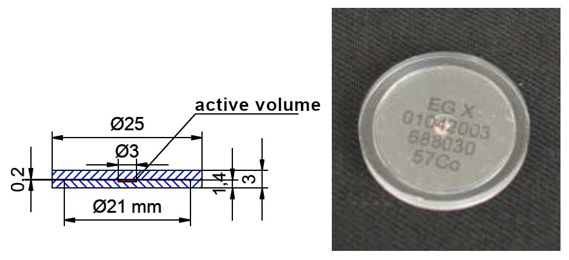

# Data measured by SÚRO employees 

The data files are licensed under [Attribution-ShareAlike 4.0 International (CC BY-SA 4.0) license](https://creativecommons.org/licenses/by-sa/4.0/)

## 01_spectra_natural_background

- common natural background, spectra "office" - measured in SÚRO office, 2nd floor; spectra "outside" - detector (in plastic bag) laid on the lawn in the garden
- data acquisition time: "office": ~ 20 min, ~ 1 hour; "outside": ~40 min, ~50 min
- download: [01_spectra_natural_background.zip](https://github.com/juhele/opengeodata/blob/master/amateur_spectrometry/_SURO_data/01_spectra_natural_background.zip)

## 02_spectra_radon_bottle

- background spectrum "Background - office 1 hour" - measured in SÚRO office, 2nd floor
- radon in common plastic bottle
- radon itself is a source of alpha radiation, but in the spectrum we detect its decay products ("radon daughters") - radioactive isotopes of Bi, Po, Pb
- data acquisition times: background: ~ 1 hour; radon bottle: ~10 min, ~20 min, ~1 hour
- download: [02_spectra_radon_bottle.zip](https://github.com/juhele/opengeodata/blob/master/amateur_spectrometry/_SURO_data/02_spectra_radon_bottle.zip)

## 03_spectra_potassium_fertilizer

- background spectrum "Background - office 1 hour" - measured in SÚRO office, 2nd floor
- commercial potassium fertilizer from garden centre
- approximately 0.01% of potassium is radioactive potassium isotope K-40
- depending on the type, the activity of K-40 in the fertilizer is approximately in the range of 2.5 - 7.7 kBq / kg
- check K-40 peak at 1460.8 keV
- data acquisition time: background: ~ 1 hour; potassium fertilizer: ~12 min
- download: [03_spectra_potassium_fertilizer.zip](https://github.com/juhele/opengeodata/blob/master/amateur_spectrometry/_SURO_data/03_spectra_potassium_fertilizer.zip)

## 04_spectra_uranium_glass

- background spectrum "Background - office 1 hour" - measured in SÚRO office, 2nd floor
- an object made of currently produced uranium glass (also nicknamed "Vaseline glass")
- according to the information from the State Office for Nuclear Safety (SÚJB) currently produced uranium glass in the Czech Republic should not contain more than 1% uranium (article in Czech): [Problematika uranem barveného skla](https://www.sujb.cz/radiacni-ochrana/oznameni-a-informace/problematika-uranem-barveneho-skla)
- data acquisition time: background: ~ 1 hour; uranium glass: ~10 min
- download: [04_spectra_uranium_glass.zip](https://github.com/juhele/opengeodata/blob/master/amateur_spectrometry/_SURO_data/04_spectra_uranium_glass.zip)

## 05_spectra_uraninite-pitchblende

- background spectrum "Background - office 1 hour" - measured in SÚRO office, 2nd floor
- sample of uraninite UO2 (also known as smolinec, Pechblende, pitchblende)
- uranium mineral, most important uranium ore, this sample is from Příbrami or Jáchymov
- data acquisition time: background: ~ 1 hour; uraninite: ~10 min
- download: [05_spectra_uraninite-pitchblende.zip](https://github.com/juhele/opengeodata/blob/master/amateur_spectrometry/_SURO_data/05_spectra_uraninite-pitchblende.zip)

## 05_spectra_uraninite-pitchblende

- background spectrum "Background - office 1 hour" - measured in SÚRO office, 2nd floor
- sample of uraninite UO2 (also known as smolinec, Pechblende, pitchblende)
- uranium mineral, most important uranium ore, this sample is from Příbrami or Jáchymov
- data acquisition time: background: ~ 1 hour; uraninite: ~10 min
- download: [05_spectra_uraninite-pitchblende.zip](https://github.com/juhele/opengeodata/blob/master/amateur_spectrometry/_SURO_data/05_spectra_uraninite-pitchblende.zip)

## 06_spectra_Jachymov_Retizkarna

- background spectrum "Background - office 1 hour" - measured in SÚRO office, 2nd floor
- the other spectra were measured in [Jáchymov](https://en.mapy.cz/s/recavuramo), in the area of former uranium mine and labor camp Rovnost (English "Equality"), some [photos here](https://flic.kr/s/aHBqjzPg5g) 
- the name comes from Czech "Řetízkárna" - nickname for the building of the former chain locker room
- some spectra are from the building, one from the road in front of it, another from the Hotel Berghof garden
- data acquisition time: background: ~ 1 hour; field measurements: ~3-12 min
- download: [06_spectra_Jachymov_Retizkarna.zip](https://github.com/juhele/opengeodata/blob/master/amateur_spectrometry/_SURO_data/06_spectra_Jachymov_Retizkarna.zip)

## 07_spectra_tritium_keychain

- background spectrum "Background - office 1 hour" - measured in SÚRO office, 2nd floor
- commercially avalable tritium keychain "nite GlowRing" - ([photo here](https://flic.kr/p/2kkHGoj)) - transparent plastic case contains sealed borosilicate glass vial with internal surface coated with a phosphor-containing material and filled with tritium gas, the beta particles from the tritium decay interact with the coating and produce visible glow 
- it is called GTLS ("gaseous tritium light source")
- the beta radiation is not able to pass through the glass wall, but GTLS devices do emit low levels of X-rays due to bremsstrahlung:
["Gaseous tritium light sources (GTLSs) and gaseous tritium light devices (GTLDs)" (PDF). Radiation Safety Handbook. Ministry of Defence (United Kingdom). May 2009. JSP 392](https://assets.publishing.service.gov.uk/government/uploads/system/uploads/attachment_data/file/946070/JSP_392_Chapter_19_-_GTLS_-GTLD__Alt_Text_.pdf)
- data acquisition time: background: ~ 1 hour; tritium: ~1 hour, ~4 hours
- download: [07_spectra_tritium_keychain.zip](https://github.com/juhele/opengeodata/blob/master/amateur_spectrometry/_SURO_data/07_spectra_tritium_keychain.zip)

## 08_spectra_EG_3X_source_Cs-137

- background spectrum "Background - office 1 hour" - measured in SÚRO office, 2nd floor
- Cs-137 radionuclide source (instrument check source) from Czech metrology institute (Czech: Český metrologický institut, ČMI, [product catalogue](https://www.cmi.cz/sites/all/files/public/download/katalog_OI%20Praha_2015_%C4%8Desky.pdf) (Czech only)), in 10 cm distance from the detector
- Cs-137, type: EG 3X, activity: 858.9 kBq, reference date: 1.7. 2015
- data acquisition time: background: ~ 1 hour; Cs-137: ~10 min, ~1 hour
- download: [08_spectra_EG_3X_source_Cs-137.zip](https://github.com/juhele/opengeodata/blob/master/amateur_spectrometry/_SURO_data/08_spectra_EG_3X_source_Cs-137.zip)

*Illustrative image and diagram of EG X type radionuclide source (image source: ČMI, translated)*

# 09_spectra_EG_3X_source_Co-60

- background spectrum "Background - office 1 hour" - measured in SÚRO office, 2nd floor
- Co-60 radionuclide source (instrument check source) from Czech metrology institute (Czech: Český metrologický institut, ČMI, [product catalogue](https://www.cmi.cz/sites/all/files/public/download/katalog_OI%20Praha_2015_%C4%8Desky.pdf) (Czech only)), in 10 cm distance from the detector
- Co-60, type: EG 3X, activity: 807.7 kBq, reference date: 1.7. 2015
- data acquisition time: background: ~ 1 hour; Co-60: ~10 min, ~1 hour
- download: [08_spectra_EG_3X_source_Cs-137.zip](https://github.com/juhele/opengeodata/blob/master/amateur_spectrometry/_SURO_data/08_spectra_EG_3X_source_Cs-137.zip)

*Illustrative image and diagram of EG X type radionuclide source* *(image source: ČMI, translated)*

*Please be patient. The pages are gradually updated, versions in CSV format will be added to the data, we will add spectrum graphs to the page and more ... Also have spectra of Cs-137, Co-60, Am-241 and other to be added and several many other to be measured in future :-)*

