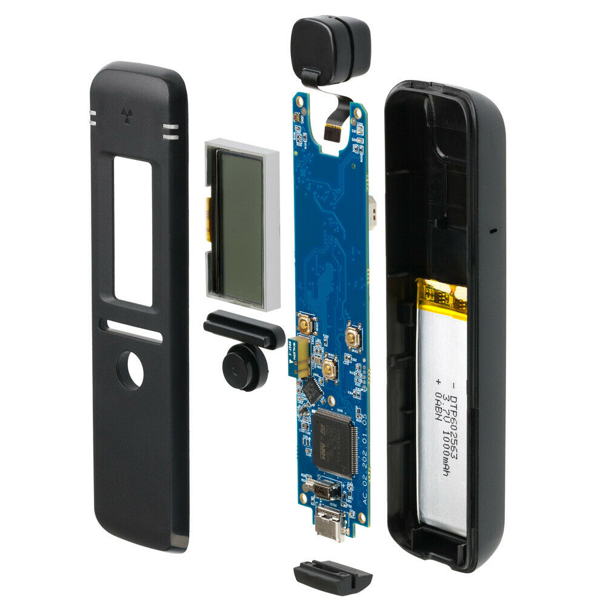

**Tyto stránky byly vytvořené v rámci řešení výzkumného tématu institucionální podpory poskytované Ministerstvem vnitra ČR**

*These pages were created within the research topic of institutional support provided by the Ministry of the Interior of the Czech Republic*

# Amatérská gamaspektrometrie s kapesním spektrometrem RadiaCode-101

# Amateur gamma spectrometry with pocket spectrometer RadiaCode-101

V rámci úkolu bude provedeno otestování komerčního, cenově dostupného kapesního spektrometru RadiaCode-101 na bázi detektoru Csl(Tl) se zaměřením na podporu tzv. občanských měření a na případné rychlé orientační měření pro potřeby hodnocení radiační situace pracovníky SÚRO.

*As part of the task, a commercial produced, affordable pocket spectrometer RadiaCode-101 based on a Csl (Tl) detector will be tested, focusing on the support of so-called citizen measurements and possible quick orientation measurements for the needs of radiation situation assessment by SÚRO employees.*

Na tomto webu budou k dispozici naměřená gamaspektrometrická data různých radioaktivních materiálů - od přírodních (minerály, horniny) přes materiály přírodního původu (NORM) po různé radionuklidové zdroje, které má SÚRO k dispozici. Tyto stránky také umožní zveřejnění dat dalším dobrovolníkům v rámci uživatelské komunity.

*Measured gamma spectrometric data of various radioactive materials will be available on this website - from natural (minerals, rocks) through materials of natural origin (NORM) to various radionuclide sources available to SÚRO emploees. This site will also allow data to be published to other volunteers within the user community.*

**O přístroji**

**About the device**

RadiaCode-101 is a pocket scintillation radiation detector + gamma spectrometer manufactured by Scan-Electronics, Russia). It uses 10×10×10 mm CsI (Caesium iodide) scintillation crystal coupled with silicon photomultiplier (SiPM). The device can be used independently, but most of its possibilities can be used when connected to a smartphone and the RadiaCode application.

exploded view of the device (© Scan-Electronics)
