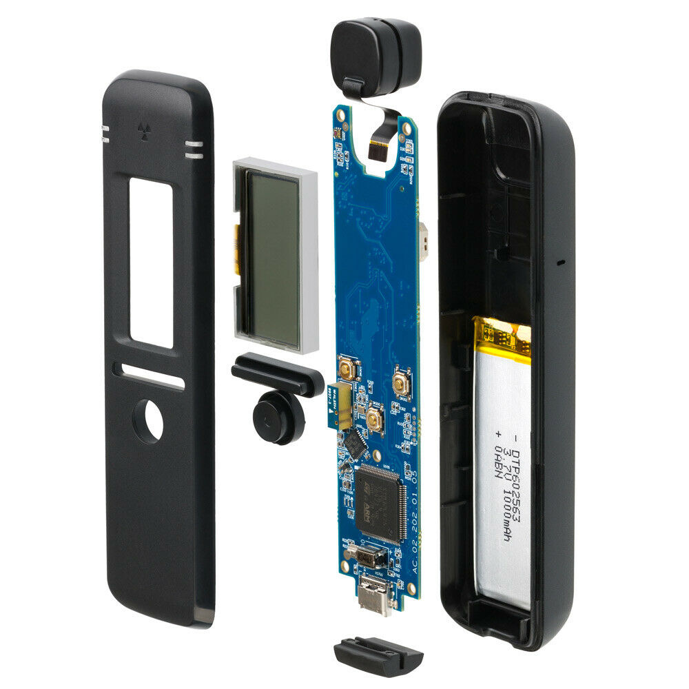

 

**Tyto stránky byly vytvořené v rámci řešení výzkumného tématu institucionální podpory poskytované Ministerstvem vnitra ČR**

# Amatérská gamaspektrometrie s kapesním spektrometrem RadiaCode-101

V rámci úkolu bude provedeno otestování komerčního, cenově dostupného kapesního spektrometru RadiaCode-101 na bázi detektoru Csl(Tl) se zaměřením na podporu tzv. občanských měření a na případné rychlé orientační měření pro potřeby hodnocení radiační situace pracovníky SÚRO.

Na tomto webu budou k dispozici naměřená gamaspektrometrická data různých radioaktivních materiálů - od přírodních (minerály, horniny) přes materiály přírodního původu (NORM) po různé radionuklidové zdroje, které má SÚRO k dispozici. Tyto stránky také umožní zveřejnění dat dalším dobrovolníkům v rámci uživatelské komunity.

**O přístroji**

**About the device**

RadiaCode-101 is a pocket scintillation radiation detector + gamma spectrometer manufactured by Scan-Electronics, Russia). It uses 10×10×10mm CsI (Caesium iodide) scintillation crystal coupled with silicon photomultiplier (SiPM). The device can be used independently, but most of its possibilities can be used when connected to a smartphone and the RadiaCode application. The device can be used for gamma dose rater mapping (GPS data is used from a connected smartphone) or for gamma spectrometry. Otput spectra have 256 channel resolution and can be shared in XML format, which can be directly viewed by other users with RadiaCode application or in other, possibly custom developed programs. Conversion to CSV is also possible. Gamma spectrometry was the reason why SÚRO bought two units in the second half of 2021. 

exploded view of the device (© Scan-Electronics)

More details about the device: [Scan-Electronics website in English](https://scan-electronics.com/en/dosimeters/radiacode-101)
